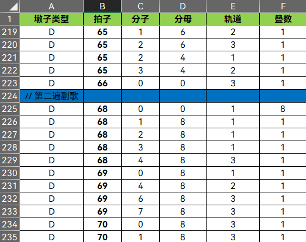
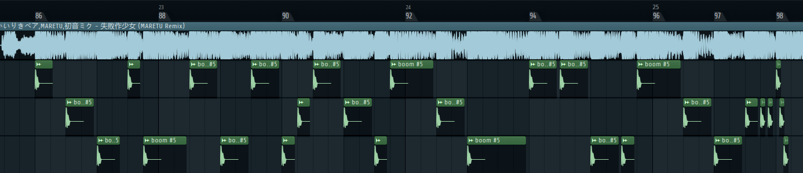

# 石墩子快跑 · 谱面制作说明
欢迎游玩本游戏！这篇文章将告诉你如何制作自己的谱面！

## 谱面文件结构
石墩子谱面文件 **(.sdx)** 本质上是一个 zip 压缩包，里面包含四份文件。
* ```data.sdz```
* ```music.mp3``` / ```music.wav```
* ```bg.png```
* ```bg.mp4```（可选）

其中：
* ```music.mp3``` 即谱面音频文件，可以是 mp3，也可以是 wav。
* ```bg.png``` 是谱面背景图片。
* ```bg.mp4``` 是谱面背景视频。
* ```data.sdz``` 是谱面的数据，接下来你的音符信息将存进这个文件里。

## ```data.sdz``` 的 [Meta] 结构
```data.sdz``` 可以通过使用各种文本编辑器进行编辑。在最开头的结构如下：
```ini
[Meta]
title = 曲目名称
author = 曲师
mapper = 谱师

level = 谱面定数

bpm = 曲目的BPM

offset = 第 0 拍相对于音频开始播放的后移量（秒）
bg_offset = 视频相对于音频开始播放的偏移量（秒）

[Data]
...
```
在这一部分请填入曲目的相关信息。

## ```data.sdz``` 的 [Data] 结构
在这一部分将是石墩子的音符信息。

谱面将按行读取并处理音符，因此你的音符排列必须严格按照正确的顺序进行排列，不能随意交换行的顺序。
### 普通石墩子音符
单个 **普通石墩子音符** 的结构如下：
```
D,拍子数,分子,分母,所在轨道,堆叠数量,剔除数量
```
谱面从第 0 拍算起。

分子和分母可以为 0。如果分母为 0，那么分数值为 0。

轨道共 3 条，分别对应数字 1、2、3。

堆叠数量即石墩子堆起来的个数，最少为 1。

**1.4.0 版本过后**，新增了「剔除数量」项。此项可以剔除已经堆叠的石墩子数，从而实现部分石墩子悬空的效果。例如，如果你已经堆了 8 个石墩子，那么你可以在此处填写 1-7 的任意数字。如果你填写了 7，那么底下的 7 个石墩子都会被剔除，只剩下第 8 个石墩子悬浮在空中。

例如，如果你想在第 32 拍的 1 / 4 处，在 2 号轨道放 1 个**普通石墩子**，那么这个音符就该这样写：
```javascript
D,32,1,4,2,1,0
```

分子是可以大于等于分母的，例如，下面几个音符就是等价的：
```javascript
D,32,4,4,2,1,0
D,33,0,4,2,1,0
D,33,0,0,2,1,0
```
但为了方便检阅，建议依然写作真分数形式。
### 绝赞石墩子音符
单个 **绝赞石墩子音符** 的结构如下：
```
X,拍子数,分子,分母,所在轨道,堆叠数量
```
用法和**普通石墩子音符**相同。
### 变化 BPM 音符
单个 **变化 BPM 音符** 的结构如下：
```javascript
B,拍子数,分子,分母,BPM
```
例如，如果你想在第 32 拍的 1 / 4 处，把 BPM 调整为 120，那么这个音符就该这样写：
```javascript
B,32,1,4,120
```
这个用法将重置先前的拍子数，因此在 BPM 变化后的音符将重新从第 0 拍开始算起。

也可以使用这个特性，来重置固定 BPM 曲子的拍子数。如：
```javascript
...
D,116,1,4,2,1,0
D,116,2,4,2,1,0
X,117,0,0,2,8,0

// 第二段
B,118,0,0,117.5
D,0,0,4,1,1,0
D,0,1,4,2,1,0
D,0,2,4,3,1,0
D,0,3,4,2,1,0
...
```

## 测试谱面 / 打包
对于 Windows 用户，你的谱面文件会存储在 ```C:\Users\*你的用户名*\AppData\LocalLow\MixBadGun\石墩子快跑\music\``` 中。

对于 MacOS 用户，则是 ```/Users/*你的用户名*/Library/Caches/MixBadGun/石墩子快跑/music/```。

对于 Andriod 用户，则是 ```/Android/data/com.mixbadgun.shidunzi/files/music/```。

在编写谱面或进行测试时，可以直接在这个目录下建立文件夹。

在谱面编写完成后，请将最上面提到的四个文件打成压缩包。四个文件必须处于压缩包的根目录下。随后，请将后缀名修改为```.sdx```。

这样你的谱面就制作完成了！可以发布给你的朋友进行游玩了！

## 编写谱面的一些小建议

建议不要写时间间隔过小甚至直接重叠、并排同时出现的音符。此类音符可能导致 AutoPlay 无法正常处理。

谱面若包含视频文件，请尽可能压缩其文件体积，因为视频文件体积往往比音频、谱面本身大得多。

在编写谱面时，你可以使用一些其它工具来辅助进行制作。例如，可以使用 Excel 来进行表格上的对齐，在表格里编写完成后，再全部复制回文本编辑器，并将 ```Tab``` 分隔符全部替换成 ```,``` 即可。



同时，你还可以使用类似 FL Studio、REAPER 等 DAW 来辅助找到对应音符的位置。



## 结束语

祝各位玩得愉快！